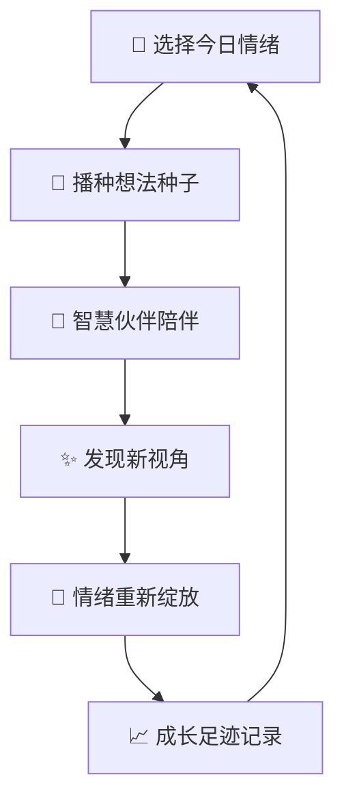
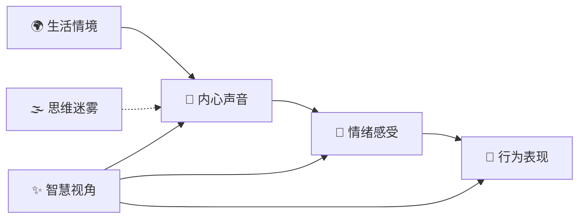
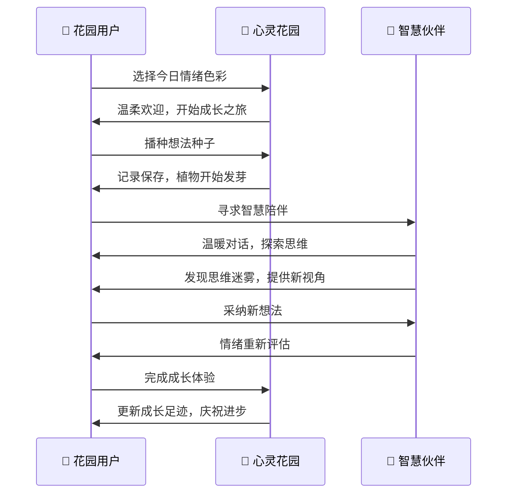

# 🌱 心灵花园 - 温暖的CBT自助工具

心灵花园是一款基于认知行为疗法(CBT)原理的温暖、灵动的自助心理健康工具。我们用花园的隐喻，让心理健康成长变得如同培育植物一般自然而温柔。

## 🌸 项目理念

> "每一个想法都是一颗种子，在温柔的关注下，它们会成长为智慧的花朵。"

心灵花园将冷冰冰的心理学工具转化为温暖、有温度的成长伙伴。我们相信：

- **温度** - 每个情绪都值得被温柔对待
- **灵动** - 成长是充满生机的动态过程  
- **希望** - 即使是最困难的想法也能绽放出智慧

## 🌿 核心功能

### 🌱 播种想法
在心灵花园的入口，选择今天的情绪色彩，开始你的成长之旅：
- **情绪花园** - 6种预设情绪 + 自定义表达
- **温柔引导** - 可选的情境描述，不强制也不评判
- **成长记录** - 记录内心的声音，让想法的种子安全发芽

### 🤖 智慧伙伴
我们的AI不是冷漠的分析师，而是24小时陪伴的智慧伙伴：
- **温暖对话** - 以聊天方式探索思维模式
- **认知洞察** - 温和地发现思维中的小迷雾
- **新的视角** - 提供多个平衡、希望的替代想法
- **情绪重估** - 采纳新视角后重新感受情绪变化

### 🌸 成长足迹
美丽的数据展示，让成长历程可见可感：
- **种子统计** - 记录播下的思维种子数量
- **花朵绽放** - 展示与智慧伙伴完成的深度对话
- **情绪花园** - 将情绪分布呈现为花朵色彩
- **成长洞察** - 智慧伙伴发现的思维模式总结

## 🌻 设计哲学

### 语言的温度
我们用温暖、充满希望的语言替代冷漠的专业术语：
- "思维种子" 而非 "自动思维"
- "智慧花朵" 而非 "认知重构" 
- "思维的小迷雾" 而非 "认知偏差"
- "成长伙伴" 而非 "治疗工具"

### 视觉的灵动
- **自然渐变** - 模拟天空、大地、植物的温柔过渡
- **生长动画** - 植物发芽、花朵绽放的生命力展示
- **微交互** - 每个点击都有温柔的反馈
- **响应式关怀** - 在任何设备上都保持温暖体验

### 流程的希望
整个使用流程设计充满希望和成长感：
1. **温柔开始** - 情绪选择不强制，可以跳过
2. **安全探索** - 想法记录强调勇敢和自我接纳
3. **智慧陪伴** - AI对话聚焦支持而非分析
4. **希望结束** - 每次体验都以成长和鼓励收尾

## 🌺 技术架构

### 前端架构
```
心灵花园 (Vue 3)
├── 🌱 MindGarden.vue - 花园入口与情绪选择
├── 🌿 ThoughtRecord.vue - 成长之旅记录流程  
├── 🤖 CognitiveAnalysis.vue - 智慧伙伴对话
├── 🌸 Dashboard.vue - 成长足迹展示
└── ⚙️ ApiConfig.vue - 花园设置
```

### 数据流程


## 🌈 CBT原理的温暖诠释

我们将传统CBT的ABC模型转化为成长花园的语言：



## 🌟 使用体验流程



## 🌸 认知模式的花园化表达

我们将常见的认知偏差转化为温和的"思维迷雾"：

| 传统术语 | 花园表达 | 温暖解释 |
|---------|---------|---------|
| 灾难化思维 | 🌪️ 风暴放大镜 | 把小雨看成了暴风雨 |
| 非黑即白 | ⚫⚪ 单色眼镜 | 世界其实有很多美丽的色彩 |
| 过度概括 | 🔄 单例循环 | 一朵花不代表整个花园 |
| 情绪推理 | 💭 感受判官 | 心情会给思维戴上有色眼镜 |
| 心理过滤 | 🔍 负面放大镜 | 只看到了凋谢，错过了新芽 |

## 🌻 环境要求

- **浏览器**: 现代浏览器（Chrome 80+, Firefox 75+, Safari 13+）
- **网络**: 需要网络连接以使用智慧伙伴功能
- **API**: OpenAI API密钥（用于智慧伙伴对话）

## 🌿 快速开始

1. **克隆花园**
   ```bash
   git clone https://github.com/ChenM0M/CBThelper.git
   cd CBThelper
   ```

2. **培育环境**
   ```bash
   npm install
   ```

3. **开启花园**
   ```bash
   npm run dev
   ```

4. **访问花园**
   打开浏览器访问 `http://localhost:5173`

5. **设置智慧伙伴**
   - 点击 ⚙️ 花园设置
   - 配置OpenAI API密钥
   - 选择智慧伙伴模型

## 🌺 贡献花园

我们欢迎每一位朋友为心灵花园贡献智慧：

- 🌱 **想法种子**: 提出新功能建议
- 🐛 **花园除虫**: 报告和修复问题  
- 📖 **成长故事**: 分享使用体验
- 🎨 **美化花园**: 改进设计和体验
- 🌍 **多语言花园**: 翻译到其他语言

## 🌈 隐私承诺

心灵花园是你私人的安全空间：
- ✅ 所有数据仅存储在您的本地设备
- ✅ 不收集、不上传、不分享个人信息
- ✅ 与智慧伙伴的对话仅用于当次分析
- ✅ 您拥有数据的完全控制权

## ⚠️ 温馨提示

心灵花园是自我探索和成长的温暖伙伴，但它不能替代专业的心理健康服务：

- 💚 如果感受到持续的情绪困扰，请寻求专业心理咨询师的帮助
- 💚 如果有自伤或自杀想法，请立即联系心理危机干预热线
- 💚 心灵花园适合作为日常情绪管理和自我觉察的辅助工具

## 🌸 许可证

本项目基于 MIT 许可证开放源代码。

---

💝 **愿每一位访问心灵花园的朋友，都能在这里找到属于自己的成长与希望。**

> "在心的花园里，每一份情绪都有它的意义，每一个想法都值得被温柔对待。" 

🌱✨🌸