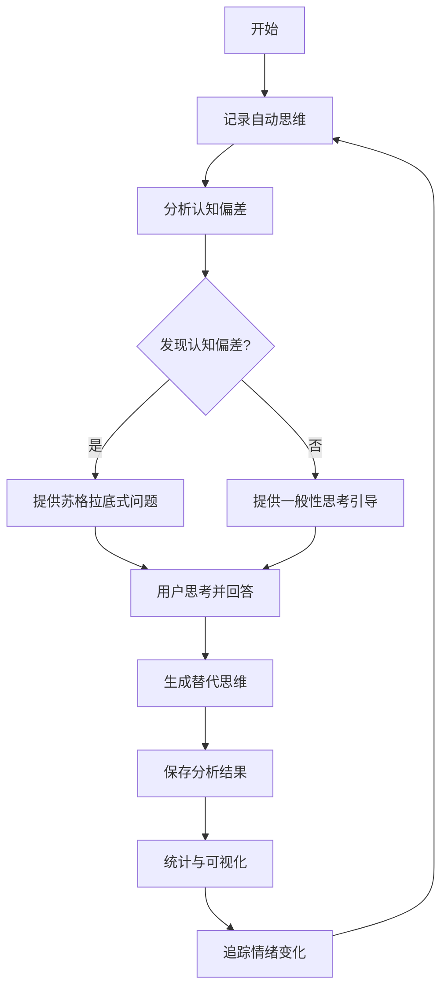
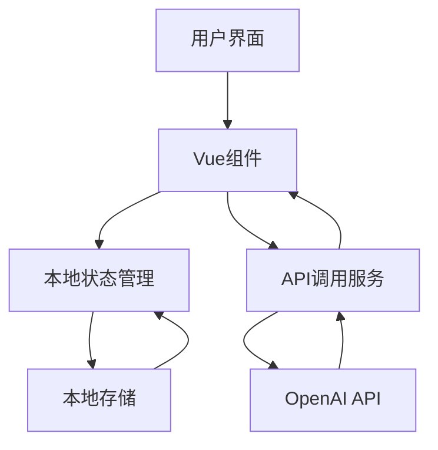
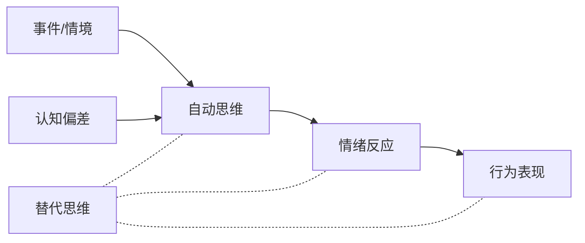
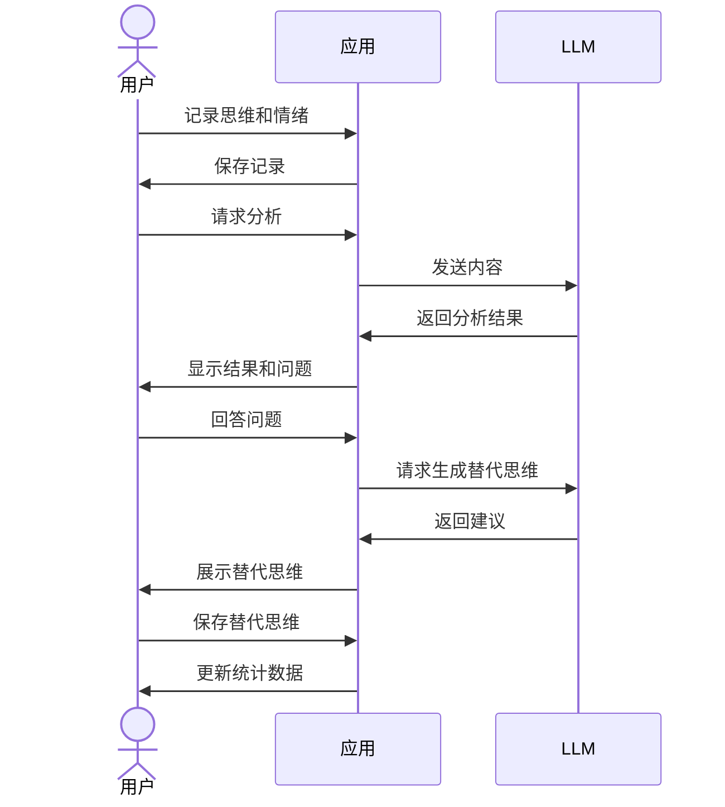

# CBThelper - 认知行为疗法辅助工具

CBThelper是一款基于认知行为疗法(CBT)原理开发的自助心理健康工具，旨在帮助用户识别、记录和改变不健康的思维模式，从而缓解情绪困扰，提升心理健康水平。

## 项目简介

认知行为疗法(Cognitive Behavioral Therapy, CBT)是一种循证有效的心理治疗方法，广泛应用于情绪障碍如抑郁症和焦虑症的治疗中。CBT的核心理念是人的情绪和行为受到思维方式的影响，通过识别和改变不合理的认知模式，可以改善情绪状态。

CBThelper将CBT的核心技术以数字化形式呈现，让用户可以随时记录自己的自动思维，获得认知偏差分析，并生成更理性的替代思维，从而帮助用户建立更健康的思维习惯。

## 核心功能

本应用提供以下核心功能：

1. **思想记录**：用户可记录情境描述、自动思维、情绪体验及强度
2. **认知分析**：自动识别记录中的认知偏差，并提供苏格拉底式提问引导
3. **替代思维**：基于用户的思考，生成更平衡理性的替代思维
4. **数据可视化**：展示情绪分布、认知偏差统计等数据
5. **历史记录管理**：查看和管理过往的思想记录和分析结果

## 用户工作流程

## 系统架构

CBThelper采用轻量级的前端应用架构，使用Vue.js框架开发，结合OpenAI API进行认知分析和替代思维生成。

### 主要组件

- **Dashboard.vue**: 主页面，展示统计数据和最近记录
- **ThoughtRecord.vue**: 思想记录组件，用于记录自动思维
- **CognitiveAnalysis.vue**: 认知分析组件，识别认知偏差并生成替代思维
- **ApiConfig.vue**: API配置组件，管理OpenAI API密钥和设置

## 认知行为疗法原理

CBT理论认为，引发情绪困扰的不是事件本身，而是我们对事件的解释和思考方式。通过识别和修正这些认知偏差，可以改善情绪反应。

## 常见认知偏差类型

本应用可识别的常见认知偏差包括：

1. **灾难化**：过分夸大负面事件的后果
2. **非黑即白**：将事物简化为两个极端类别
3. **过度概括**：从单一事件中得出普遍结论
4. **情绪推理**：根据情绪状态而非客观事实做判断
5. **应该陈述**：用刚性的规则要求自己或他人
6. **心理过滤**：只关注负面细节而忽视积极方面
7. **个人化**：不合理地将外部事件归因于自己
8. **控制谬误**：认为应当能控制所有事情
9. **贴标签**：用简单标签概括复杂情况
10. **读心术**：假设知道他人的想法或感受

## 使用流程

## 项目理念与价值

CBThelper的理念是将专业心理学工具民主化，使更多人能够获得心理健康支持。项目设计遵循以下原则：

1. **注重隐私**：所有数据仅存储在用户本地，保护用户隐私
2. **简单易用**：界面友好，操作简单，降低使用门槛
3. **专业可靠**：基于循证有效的CBT技术，辅以AI增强分析能力
4. **个性化辅导**：基于用户独特情境提供针对性分析和建议
5. **自助成长**：鼓励用户主动参与思考，培养健康思维习惯

## 未来展望

CBThelper计划在未来增加以下功能：

1. **离线模式**：无需互联网也可使用基本功能
2. **更多数据分析**：识别更复杂的思维模式和情绪变化趋势
3. **个性化辅导建议**：基于用户历史记录提供量身定制的练习建议
4. **社区支持**：可选的匿名社区支持功能
5. **专业引导**：与专业心理健康资源对接

---

CBThelper不是专业心理治疗的替代品，而是自我探索和成长的辅助工具。如果您正经历严重的心理健康问题，请咨询专业心理医生或心理治疗师。 