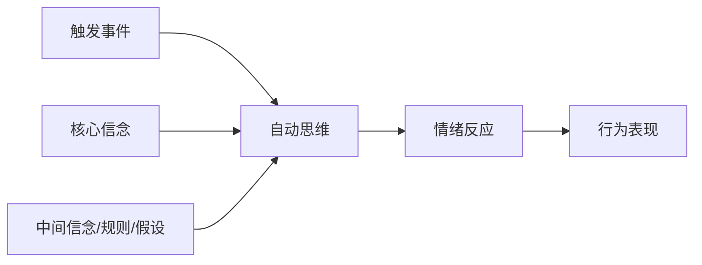
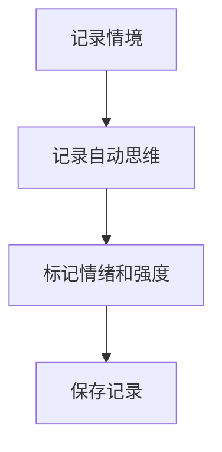
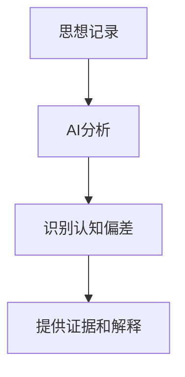
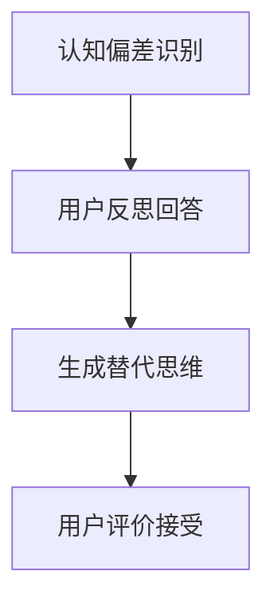

# 认知行为疗法(CBT)与CBThelper

## 认知行为疗法概述

认知行为疗法(Cognitive Behavioral Therapy, CBT)是当代心理治疗领域最具循证支持的治疗方法之一，由Aaron Beck博士于20世纪60年代创立。CBT基于这样一个核心理念：我们的情绪和行为主要受到我们如何解释和思考事件的影响，而非事件本身。

CBT已被证明在治疗多种心理健康问题中有效，包括：

- 抑郁症
- 焦虑障碍
- 强迫症
- 创伤后应激障碍(PTSD)
- 进食障碍
- 慢性疼痛管理

## CBT的核心理论基础

### 认知模型

CBT的基础是认知模型，这一模型描述了事件、思想、情绪和行为之间的关系：



在这一模型中：

- **触发事件**：外部发生的事情或情境
- **自动思维**：对事件的即时、自发的解释或评价
- **核心信念**：关于自己、他人和世界的基本信念
- **中间信念**：包括态度、规则和假设
- **情绪反应**：思维引发的情感体验
- **行为表现**：受情绪驱动的行为

### 认知偏差

认知偏差是扭曲的思维模式，会导致非理性解释和消极情绪。CBT识别并矫正这些偏差是治疗的核心。常见的认知偏差包括：

| 认知偏差类型 | 描述 | 例子 |
|------------|------|------|
| 灾难化 | 预期最糟糕的结果 | "如果我考试失败，我的一生就毁了" |
| 非黑即白思维 | 将事物简化为两个极端 | "要么完美，要么彻底失败" |
| 过度概括 | 从单一事件中得出普遍结论 | "我一次演讲失败，说明我永远不能公开演讲" |
| 心理过滤 | 只关注负面细节而忽视积极方面 | "尽管报告获得好评，但有一个小错误使整个工作毫无价值" |
| 读心术 | 假设知道他人想法 | "他没回我信息，肯定是不喜欢我" |

## CBT的治疗流程

传统CBT治疗通常包含以下阶段：

1. **评估阶段**：识别问题、目标和治疗方向
2. **概念化阶段**：建立认知行为模型，理解思维、情绪和行为的联系
3. **干预阶段**：学习和应用CBT技术
4. **巩固和预防复发阶段**：强化技能，预防问题复发

## CBT核心技术

CBT包含多种实用技术，以下是几种核心方法：

### 1. 思想记录

记录自动思维、相关情绪和证据，是CBT的基础技术：

```
情境 → 自动思维 → 情绪反应 → 认知偏差识别 → 替代思维
```

### 2. 苏格拉底式提问

通过系统性提问挑战非理性思维：
- "有什么证据支持/反对这个想法？"
- "还有其他可能的解释吗？"
- "如果朋友遇到相同情况，我会怎么建议他？"

### 3. 行为实验

设计和执行实验来检验信念的有效性，收集真实证据。

### 4. 暴露疗法

逐步接触引发焦虑的情境，降低恐惧反应。

## CBThelper：数字化CBT自助工具

CBThelper是一款将CBT核心原理数字化的自助工具，旨在帮助用户应用CBT技术改善心理健康。

### CBThelper如何实现CBT原理

CBThelper通过以下方式实现CBT的核心原理：

#### 1. 思想记录功能



用户可以记录触发情境、自动思维、情绪反应及其强度，这是CBT的第一步——识别自己的思维模式。

#### 2. 认知偏差识别



CBThelper利用AI技术自动识别用户思维中的认知偏差，并解释为什么这些思维模式可能不准确或不健康。

#### 3. 苏格拉底式提问引导

系统根据识别到的认知偏差，生成针对性的苏格拉底式问题，引导用户思考：
- 支持这一想法的证据是什么？
- 反对这一想法的证据是什么？
- 有哪些替代性解释？
- 这种想法对我有帮助吗？

#### 4. 替代思维生成



根据用户的思考和反馈，系统生成更平衡、更理性的替代思维，帮助用户建立更健康的认知模式。

### CBThelper的CBT理论优势

1. **实时可及性**：随时随地记录和分析思维
2. **私密性**：避免面对面治疗的社交压力
3. **个性化分析**：基于用户独特情况提供针对性反馈
4. **系统化追踪**：记录思维模式变化和情绪变化趋势
5. **学习CBT技能**：在使用过程中学习CBT的核心技术

## 使用CBThelper进行自助CBT的步骤

### 步骤一：记录自动思维

1. 识别触发情境
2. 记录当时闪过脑海的自动思维
3. 标记相关情绪和强度

### 步骤二：分析认知模式

1. 使用分析功能识别认知偏差
2. 理解偏差如何影响情绪
3. 反思提供的证据和解释

### 步骤三：质疑和挑战思维

1. 思考系统提供的苏格拉底式问题
2. 记录自己的反思和回答
3. 评估思维的合理性和有效性

### 步骤四：发展替代思维

1. 考虑系统生成的替代思维
2. 调整和内化更平衡的思维方式
3. 练习在类似情境中应用新思维模式

### 步骤五：追踪进展

1. 定期回顾历史记录
2. 观察情绪趋势变化
3. 识别常见认知偏差模式

## CBT数字化工具的局限与注意事项

尽管CBThelper提供了宝贵的自助工具，但重要的是认识到其局限性：

1. **不适用于严重心理健康问题**：严重抑郁、自杀意念或精神病症状需要专业治疗
2. **不能替代专业治疗**：最好作为专业治疗的补充使用
3. **需要用户主动参与**：效果取决于用户的投入和实践
4. **技术限制**：AI分析无法完全替代人类治疗师的专业判断

## 结语

CBThelper代表了数字心理健康工具的创新应用，将循证有效的CBT原理转化为易于使用的数字形式。通过系统性地应用CBT技术，用户可以学习识别和改变不健康的思维模式，培养心理韧性，提升情绪调节能力。

请记住，心理健康是一个持续的旅程，CBThelper是这一旅程中的实用工具，但不能替代专业指导。如果您面临严重的心理健康挑战，请寻求专业心理健康服务的支持。

---

*"改变你的思维，你就能改变你的感受。"* —— Aaron Beck，认知行为疗法创始人 