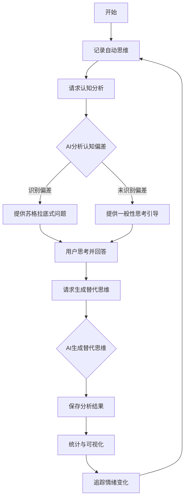
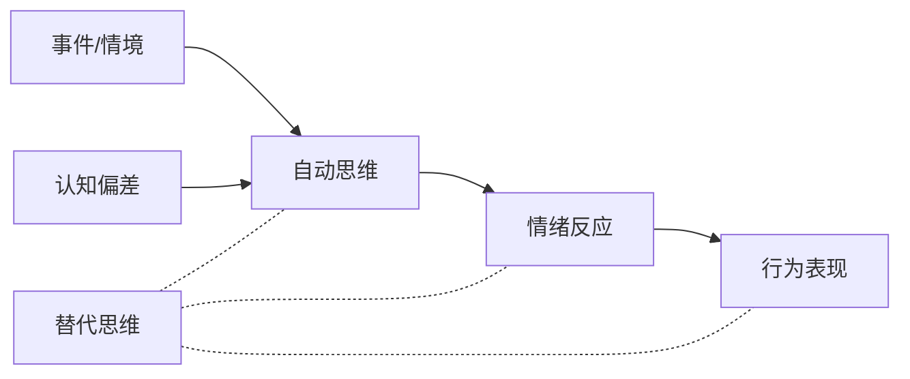

# CBThelper - 认知行为疗法辅助工具

CBThelper是一款基于认知行为疗法(CBT)原理开发的自助心理健康工具，旨在帮助用户识别、记录和改变不健康的思维模式，从而缓解情绪困扰，提升心理健康水平。

## 项目简介

认知行为疗法(Cognitive Behavioral Therapy, CBT)是一种循证有效的心理治疗方法，广泛应用于情绪障碍如抑郁症和焦虑症的治疗中。CBT的核心理念是人的情绪和行为受到思维方式的影响，通过识别和改变不合理的认知模式，可以改善情绪状态。

CBThelper将CBT的核心技术以数字化形式呈现，让用户可以随时记录自己的自动思维，获得认知偏差分析，并生成更理性的替代思维，从而帮助用户建立更健康的思维习惯。

## 核心功能

本应用提供以下核心功能：

1.  **思想记录**：用户可记录情境描述、自动思维、情绪体验及强度
2.  **认知分析 (AI驱动)**：利用大型语言模型(LLM)自动识别记录中的认知偏差，并提供苏格拉底式提问引导
3.  **替代思维生成 (AI驱动)**：基于用户的思考，生成更平衡理性的替代思维
4.  **数据可视化**：展示情绪分布、认知偏差统计等数据
5.  **历史记录管理**：查看和管理过往的思想记录和分析结果

## 用户工作流程



## 系统架构 (含Vercel部署)

CBThelper采用前后端分离的架构，前端使用Vue.js，后端利用Vercel Serverless Functions处理敏感的LLM API调用。

```mermaid
graph TD
    subgraph Browser
        A[用户界面 Vue.js] --> B[Vue组件]
        B --> C[本地状态管理 localStorage]
        B --> D[调用代理API /api/llm-proxy]
    end
    subgraph Vercel
        D --> E[Serverless Function (api/llm-proxy.js)]
        E --> F[读取Vercel环境变量 (URL, Key, Model)]
        E --> G[LLM API (如 OpenAI)]
        G --> E
        E --> D
    end
    C --> B
```

### 主要组件

-   **前端**: `Dashboard.vue`, `ThoughtRecord.vue`, `CognitiveAnalysis.vue`, `ApiConfig.vue` (可选)
-   **后端代理**: `api/llm-proxy.js` (运行在Vercel Serverless环境)

## 部署到 Vercel (推荐)

部署此项目到Vercel是最简单且安全的方式。

1.  **Fork 或克隆此仓库**
2.  **在 Vercel 上连接您的仓库**：登录Vercel，选择 "Add New..." -> "Project"，然后选择您的仓库。
3.  **配置环境变量**：在项目设置的 "Environment Variables" 中添加以下变量：
    *   `LLM_API_KEY`：您的LLM API密钥 (例如 OpenAI key `sk-xxxx`)。**必须设置为 Secret**。
    *   `LLM_API_URL`：(可选) 您的LLM API端点。如果省略，默认为 OpenAI 的 `https://api.openai.com/v1/chat/completions`。
    *   `LLM_MODEL_NAME`：(可选) 您希望使用的LLM模型名称。如果省略，默认为 `gpt-3.5-turbo`。
4.  **部署**：Vercel 会自动检测到 Vue.js 项目和 `api` 目录下的 Serverless Function，并进行构建和部署。

部署完成后，您的应用将使用配置好的环境变量通过后端代理安全地调用LLM API。

## 认知行为疗法原理



CBT理论认为，引发情绪困扰的不是事件本身，而是我们对事件的解释和思考方式。通过识别和修正这些认知偏差，可以改善情绪反应。

## 项目理念与价值

CBThelper的理念是将专业心理学工具民主化，使更多人能够获得心理健康支持。

1.  **注重隐私**：用户思想记录存储在本地浏览器；API密钥通过安全后端代理处理。
2.  **简单易用**：界面友好，操作简单。
3.  **专业可靠**：基于循证有效的CBT技术，辅以AI增强分析能力。
4.  **个性化辅导**：基于用户独特情境提供针对性分析和建议。
5.  **自助成长**：鼓励用户主动参与思考，培养健康思维习惯。

## 注意事项

-   CBThelper不是专业心理治疗的替代品。
-   如果您正经历严重的心理健康问题，请咨询专业心理医生或心理治疗师。

---

*"改变你的思维，你就能改变你的感受。"* —— Aaron Beck 